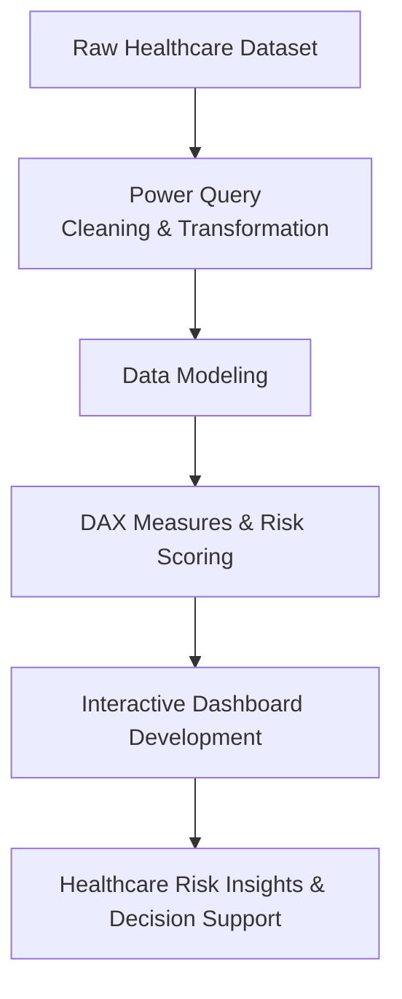

# Healthcare_Risk_Analytics_Dashboard
End-to-end Healthcare Risk Analytics Dashboard built with Power BI, Power Query, and DAX to analyze patient risk factors, clinical indicators, lifestyle behaviors, and operational healthcare outcomes.

## Project Overview

The Healthcare Analytics Dashboard is an end-to-end Business Intelligence solution designed to analyze patient health conditions, lifestyle risk factors, clinical indicators, and operational performance metrics.

The project leverages Power BI and Power Query to transform raw healthcare data into actionable insights for healthcare professionals, administrators, and decision-makers.

The dashboard provides a comprehensive view of patient demographics, disease prevalence, risk categorization, lifestyle behaviors, and hospital length of stay (LOS), enabling data-driven decision-making and proactive patient management.

---

## Business Problem

Healthcare organizations generate vast amounts of patient data; however, deriving meaningful insights from this information remains a challenge.

This project aims to answer critical questions such as:

* What are the most prevalent medical conditions among patients?
* Which demographic groups are most affected by specific conditions?
* How do lifestyle factors influence patient health outcomes?
* Which patients are at elevated cardiovascular and lifestyle-related risk?
* What factors contribute to longer hospital stays?
* What relationships exist between clinical and lifestyle indicators?

---

## Business Impact

This dashboard enables healthcare stakeholders to:

- Identify high-risk patient populations.
- Monitor disease prevalence and demographic trends.
- Understand the impact of lifestyle factors on health outcomes.
- Evaluate operational performance through Length of Stay analysis.
- Support proactive interventions through risk segmentation and correlation insights.

---

## Repository Structure

```text
Healthcare-Risk-Analytics-Dashboard
│
├── Data
│   └── Healthcare Dataset.xlsx
│
├── Dashboard
│   └── Healthcare Risk Analytics Dashboard.pbix
│
├── Images
│   ├── Executive Overview.png
│   ├── Clinical Analytics.png
│   ├── Lifestyle Risk Analytics.png
│   ├── Operational Analytics.png
│   └── Data Quality & Risk Segmentation.png
│
└── README.md
```

---

## Project Workflow




---

## Dataset Information

The dataset contains approximately **30,000 patient records** and includes demographic, clinical, lifestyle, and operational health indicators.

### Key Features

#### Demographics

* Age
* Gender

#### Medical Information

* Medical Condition
* Family History

#### Clinical Indicators

* Glucose
* Blood Pressure
* BMI
* Oxygen Saturation
* Cholesterol
* Triglycerides
* HbA1c

#### Lifestyle Factors

* Smoking Status
* Alcohol Consumption
* Physical Activity
* Diet Score
* Stress Level
* Sleep Hours

#### Operational Metrics

* Length of Stay (LOS)

The dataset also contained missing values and noise features, which were addressed during the data preparation process.

---

## Project Objectives

The primary objectives of this project were to:

* Analyze patient demographics and disease prevalence.
* Evaluate clinical health indicators.
* Assess lifestyle-related health risks.
* Develop custom risk scoring models.
* Identify factors influencing hospital length of stay.
* Explore relationships among health variables through correlation analysis.
* Build an interactive dashboard to support decision-making.

---

## Data Cleaning and Transformation

Data preparation was performed using **Power Query**.

### Cleaning Activities

* Removed irrelevant noise columns.
* Handled missing values.
* Corrected data types.
* Created Age Groups.
* Created BMI Categories.
* Standardized categorical variables.
* Developed a separate analytical reference table for advanced visualizations.
* Unpivoted selected variables for flexible analysis.

### Feature Engineering

Additional calculated fields were created, including:

* Age Groups
* BMI Groups
* Risk Categories
* Lifestyle Risk Indicators
* Cardiac Risk Indicators

---

## Risk Scoring Methodology

### Cardiac Risk Score

Patients were assessed using a custom cardiac risk scoring model based on:

| Indicator      | Criteria                |
| -------------- | ----------------------- |
| Blood Pressure | Elevated BP Threshold   |
| Cholesterol    | High Cholesterol Levels |
| Triglycerides  | Elevated Triglycerides  |
| HbA1c          | Poor Glycemic Control   |
| Smoking        | Current Smoker          |
| Alcohol        | Alcohol Consumption     |
| Family History | Positive Family History |

Patients were categorized into:

* Low Risk
* Moderate Risk
* High Risk

---

### Lifestyle Risk Score

Lifestyle risk was assessed using:

* Physical Activity
* Diet Score
* Stress Level
* Sleep Hours

Patients were grouped into:

* Healthy Lifestyle
* Moderate Lifestyle Risk
* High Lifestyle Risk

---

## Dashboard Pages

### 1. Executive Overview

Provides a high-level summary of:

- Total Patients
- Average Age
- Average Length of Stay
- Gender Distribution
- Disease Prevalence
- Healthy vs Diseased Population
- Risk Category Distribution
- Key Clinical and Lifestyle Correlations

---

### 2. Clinical Analytics

Focuses on clinical health indicators including:

* Blood Pressure Analysis
* Glucose Analysis
* HbA1c Analysis
* BMI Analysis
* Cholesterol Analysis
* Triglyceride Analysis
* Clinical Risk Segmentation

---

### 3. Lifestyle Risk Analytics

Analyzes lifestyle factors and their impact on health outcomes.

Key analyses include:

* Physical Activity vs BMI
* Diet Score vs Glucose
* Stress Level vs Blood Pressure
* Sleep Hours vs Stress Level

---

### 4. Operational Analytics

Evaluates hospital performance indicators including:

* Average Length of Stay
* Length of Stay by Medical Condition
* Length of Stay by Age Group
* Length of Stay by BMI Group
* Length of Stay by Risk Category

---

### 5. Data Quality & Risk Segmentation

Documents:

* Data Quality Summary
* Age Group Methodology
* Risk Categorization Logic
* Cardiac Risk Scoring Methodology
* Lifestyle Risk Scoring Methodology
* Correlation Analysis

---

### Correlation Insights

To support analytical storytelling, a correlation analysis was conducted to identify the strongest relationships among clinical and lifestyle variables.

The strongest relationships were highlighted directly within the Executive Overview dashboard to provide stakeholders with immediate visibility into key health drivers.

Key findings included:

| Relationship | Correlation |
|-------------|------------|
| Glucose ↔ HbA1c | 0.62 |
| Physical Activity ↔ Diet Score | 0.47 |
| HbA1c ↔ Diet Score | -0.35 |
| Physical Activity ↔ BMI | -0.35 |
| Diet Score ↔ Glucose | -0.31 |

### Insights

* Higher glucose levels are associated with increased HbA1c.
* Better diet quality is associated with improved glycemic control.
* Increased physical activity is associated with lower BMI.
* Blood pressure tends to increase with age.
* Lifestyle behaviors exhibit measurable effects on health outcomes.

---

## Key Insights

### Clinical Insights

* Diabetes and hypertension were among the most prevalent conditions.
* Elevated glucose levels strongly correlated with HbA1c levels.
* Higher-risk patients exhibited poorer clinical indicators.

### Lifestyle Insights

* Patients with healthier diets generally recorded lower glucose levels.
* Increased physical activity was associated with lower BMI.
* Higher stress levels were associated with elevated blood pressure.

### Operational Insights

* Certain medical conditions were associated with longer hospital stays.
* Higher-risk patients tended to have increased length of stay.

---

## Tools & Technologies

* Power BI
* Power Query
* DAX
* Microsoft Excel
* Data Modeling
* Data Visualization
* Statistical Analysis

---

## Skills Demonstrated

### Data Analytics

* Data Cleaning
* Data Transformation
* Data Modeling
* Data Exploration
* Statistical Analysis

### Business Intelligence

* KPI Development
* Dashboard Design
* Interactive Reporting
* Data Storytelling

### Healthcare Analytics

* Risk Stratification
* Clinical Analytics
* Lifestyle Analytics
* Operational Analytics

---

## Future Improvements

Potential enhancements include:

* Dynamic correlation analysis using DAX.
* Predictive risk modeling.
* Patient outcome forecasting.
* Machine learning integration.
* Real-time healthcare monitoring.

---

## Dashboard Preview

### Executive Overview


### Clinical Analytics


### Lifestyle Risk Analytics


### Operational Analytics


### Data Quality & Risk Segmentation


---

## Key Achievements

- Processed and analyzed 30,000 healthcare records.
- Developed custom Cardiac Risk and Lifestyle Risk scoring frameworks.
- Built five interactive dashboard pages.
- Conducted correlation analysis to identify key health risk drivers.
- Created an executive-level reporting solution for healthcare decision-making.
- Applied Power Query, DAX, and data modeling best practices.

---

## Author

**Bright Marfo Twumasi**

Founder & Lead Consultant, BrightData Consult

Specializing in:

* Data Analytics
* Business Intelligence
* Data Protection & Privacy
* Quality Management Systems

LinkedIn: LinkedIn: [Bright Twumasi](https://www.linkedin.com/in/bright-twumasi-a7573290)

Website: [BrightData Consult](https://www.brightdataconsult.com)
